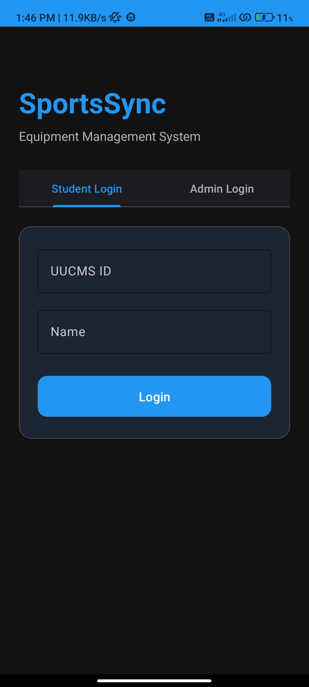
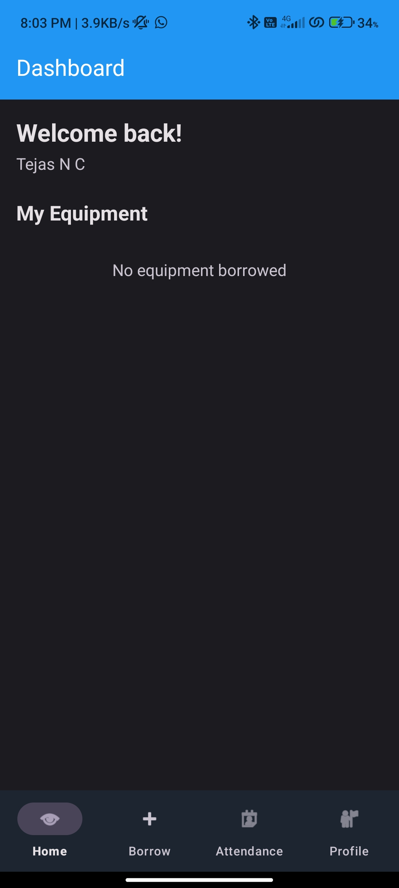
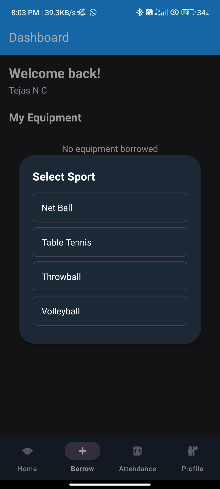
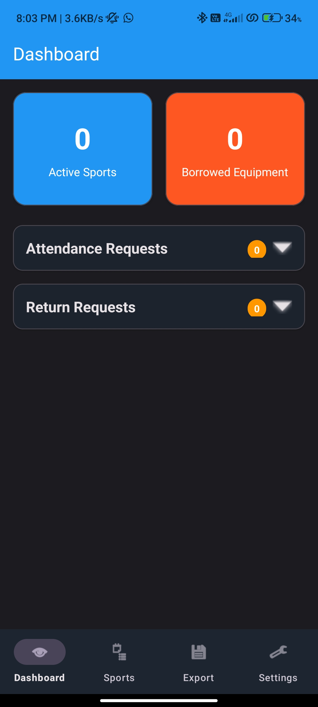
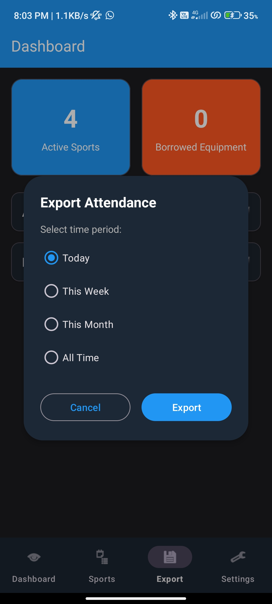
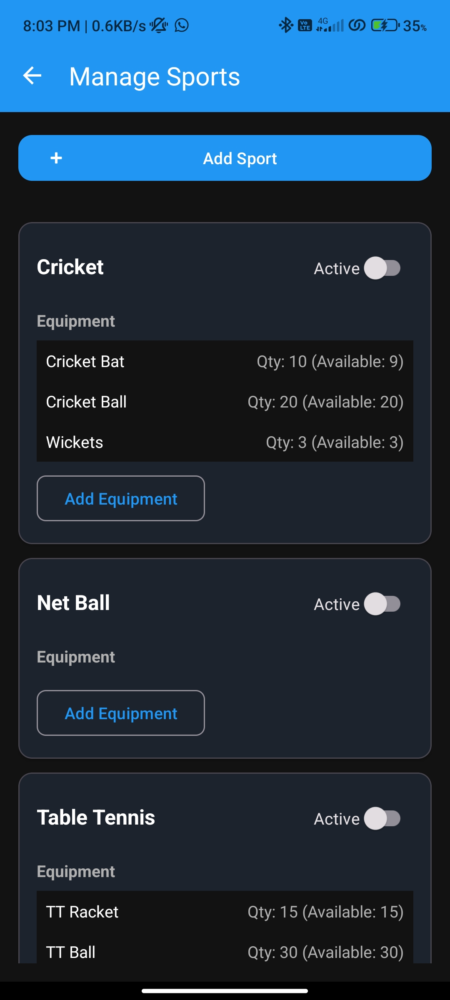

# SportsSync - Sports Equipment Management System

<div align="center">


**A comprehensive mobile solution for managing sports equipment borrowing and attendance tracking in educational institutions.**

[Features](#-features) • [Architecture](#-architecture) • [Screenshots](#-screenshots) • [Installation](#-installation) • [Technology Stack](#-technology-stack)

</div>

---

##  Overview

SportsSync is a modern Android application designed to streamline sports equipment management and attendance tracking in colleges and universities. The system provides separate interfaces for students and administrators, enabling efficient equipment borrowing, real-time notifications, and comprehensive attendance management.

###  Problem Statement

Educational institutions face challenges in:
- Tracking sports equipment lending and returns
- Managing attendance for sports activities
- Preventing equipment loss and mismanagement
- Maintaining accurate records for reporting

###  Solution

SportsSync provides a digital solution with:
- QR code-based authentication and attendance
- Real-time equipment tracking
- Automated return reminders
- Comprehensive admin dashboard
- Excel-based reporting system

---

##  Features

###  Student Features

- **Smart Authentication**
	- UUCMS ID-based login with duplicate prevention
	- One-time QR code registration
	- Automatic session persistence

- **Equipment Management**
	- Browse available sports and equipment
	- Real-time availability checking
	- Instant borrowing confirmation
	- Return request submission

- **Attendance System**
	- QR code-based attendance marking
	- Attendance history tracking
	- Real-time approval notifications

- **User Dashboard**
	- Active borrowed equipment display
	- Return time reminders
	- Personal statistics (total borrows, active items, attendance count)
	- Profile management

###  Admin Features

- **Comprehensive Dashboard**
	- Active sports and borrowed equipment statistics
	- Collapsible request sections for better space management
	- Real-time data updates with pull-to-refresh

- **Request Management**
	- Attendance request approval/rejection
	- Equipment return approval/rejection
	- Bulk approve/reject operations
	- Pending request count badges

- **Sports & Equipment Management**
	- Add new sports dynamically
	- Add equipment to existing sports
	- Toggle sport availability
	- Track equipment quantities (total and available)

- **Advanced Features**
	- Dynamic QR code generation for attendance
	- Excel export with date filters (daily/weekly/monthly/all-time)
	- Developer information Easter egg
	- Comprehensive reporting system

###  Notification System

- **Automated Reminders**
	- Equipment return notifications at 4 PM and 5 PM
	- Immediate borrow confirmation notifications

- **Real-time Updates**
	- Instant attendance approval/rejection notifications
	- Return request status updates
	- Firebase Cloud Messaging integration

---

## 🏗️ Architecture

### Application Architecture

```
┌────────────────────────────────────────┐
│           Presentation Layer           │
│  ┌────────────┐      ┌────────────┐    │
│  │  Student   │      │   Admin    │    │
│  │   Views    │      │   Views    │    │
│  └────────────┘      └────────────┘    │
└────────────────────────────────────────┘
                    │
                    ▼
┌────────────────────────────────────────┐
│            Business Logic              │
│  ┌──────────────────────────────────┐  │
│  │  Activities & Fragments          │  │
│  │  • StudentDashboardActivity      │  │
│  │  • AdminDashboardActivity        │  │
│  │  • LoginActivity                 │  │
│  │  • ManageSportsActivity          │  │
│  └──────────────────────────────────┘  │
│  ┌──────────────────────────────────┐  │
│  │  Adapters (RecyclerView)         │  │
│  │  • BorrowedEquipmentAdapter      │  │
│  │  • AttendanceRequestAdapter      │  │
│  │  • SportManageAdapter            │  │
│  └──────────────────────────────────┘  │
└────────────────────────────────────────┘
                    │
                    ▼
┌────────────────────────────────────────┐
│             Data Layer                 │
│  ┌──────────────────────────────────┐  │
│  │  Firebase Services               │  │
│  │  • Firestore (Database)          │  │
│  │  • Authentication                │  │
│  │  • Cloud Messaging               │  │
│  └──────────────────────────────────┘  │
│  ┌──────────────────────────────────┐  │
│  │  Local Storage                   │  │
│  │  • SharedPreferences             │  │
│  │  • Notification Scheduler        │  │
│  └──────────────────────────────────┘  │
└────────────────────────────────────────┘
```

### Data Models

```java
User
├── uid: String
├── uucmsId: String
├── name: String
├── userType: String
├── isRegistered: Boolean
└── registeredAt: Long

BorrowRecord
├── recordId: String
├── studentId: String
├── equipmentId: String
├── quantity: Integer
├── borrowedAt: Long
├── returnBy: Long
└── status: String

Sport
├── sportId: String
├── sportName: String
├── equipmentList: List<Equipment>
├── isActive: Boolean
└── createdAt: Long
```

---

##  Screenshots

### Student Interface

| Login Screen | Dashboard | Equipment Selection |
|--------------|-----------|---------------------|
|  |  |  |

### Admin Interface

| Admin Dashboard | Manage Sports | Export Options |
|-----------------|---------------|----------------|
|  |  |  |

---

##  Technology Stack

### Core Technologies

| Category | Technology | Purpose |
|----------|-----------|---------|
| **Language** | Java 11 | Primary development language |
| **Platform** | Android SDK 24-34 | Target Android 7.0 to Android 14 |
| **IDE** | Android Studio | Development environment |
| **Build System** | Gradle 8.2 | Build automation |

### Backend & Database

| Technology | Purpose |
|------------|---------|
| **Firebase Authentication** | Anonymous user authentication |
| **Cloud Firestore** | NoSQL real-time database |
| **Firebase Cloud Messaging** | Push notifications |
| **Firebase Storage** | QR code and data storage |

### Libraries & Dependencies

```gradle
// UI Components
implementation 'com.google.android.material:material:1.9.0'
implementation 'androidx.constraintlayout:constraintlayout:2.1.4'

// Firebase
implementation platform('com.google.firebase:firebase-bom:32.3.1')
implementation 'com.google.firebase:firebase-auth'
implementation 'com.google.firebase:firebase-firestore'
implementation 'com.google.firebase:firebase-messaging'

// QR Code Scanning
implementation 'com.journeyapps:zxing-android-embedded:4.3.0'
implementation 'com.google.zxing:core:3.5.2'

// Excel Export
implementation 'org.apache.poi:poi:5.2.3'
implementation 'org.apache.poi:poi-ooxml:5.2.3'
```

### Design Patterns

- **MVC Architecture**: Model-View-Controller for separation of concerns
- **Singleton Pattern**: Firebase manager and preference manager
- **Observer Pattern**: Real-time Firebase listeners
- **Adapter Pattern**: RecyclerView adapters for list management
- **Factory Pattern**: Dialog and notification creation

---

## Installation

### Prerequisites

- Android Studio Hedgehog or later
- JDK 11 or higher
- Android SDK with API 24-34
- Firebase account

### Setup Steps

1. **Clone the repository**
   ```bash
   git clone https://github.com/yourusername/sportssync.git
   cd sportssync
   ```

2. **Firebase Configuration**
	- Create a new Firebase project at [Firebase Console](https://console.firebase.google.com)
	- Add an Android app with package name: `com.sportssync.app`
	- Download `google-services.json`
	- Place it in `app/` directory

3. **Enable Firebase Services**
	- Enable Anonymous Authentication
	- Create Firestore Database (production mode)
	- Enable Cloud Messaging

4. **Update Firestore Rules**
   ```javascript
   rules_version = '2';
   service cloud.firestore {
     match /databases/{database}/documents {
       match /{document=**} {
         allow read, write: if request.auth != null;
       }
     }
   }
   ```

5. **Build and Run**
   ```bash
   ./gradlew assembleDebug
   ```
   Or use Android Studio's Run button

### Default Admin Credentials

```
Username: Admin
Password: admin123
```

### QR Codes for Testing

- **Registration QR**: `REGISTER_SPORTS_SYNC`
- **Attendance QR**: Generated dynamically by admin

---

##  UI/UX Features

### Design Philosophy

- **Material Design 3**: Modern, adaptive design system
- **Dark Mode Support**: Automatic theme switching based on system preferences
- **Bottom Navigation**: Intuitive navigation pattern for both user types
- **Collapsible Sections**: Space-efficient content organization
- **Loading States**: Clear feedback during asynchronous operations
- **Empty States**: Helpful messages when no data is available

### Color Scheme

| Theme | Primary | Accent | Background |
|-------|---------|--------|------------|
| Light | #1976D2 | #FF5722 | #F5F5F5 |
| Dark | #2196F3 | #FF5722 | #121212 |

### Accessibility

- High contrast ratios for readability
- Material You dynamic color support
- Touch target sizes ≥48dp
- Screen reader compatible
- Semantic content descriptions

---

## Security Features

- **Authentication**: Firebase Anonymous Auth with UUCMS validation
- **Data Validation**: Input sanitization and format checking
- **Duplicate Prevention**: UUCMS uniqueness enforcement
- **Session Management**: Secure preference storage
- **Permission Handling**: Runtime permission requests for camera and notifications

---

##  Database Schema

### Collections

```
users/
├── {userId}
    ├── uid: string
    ├── uucmsId: string
    ├── name: string
    ├── userType: "student" | "admin"
    ├── isRegistered: boolean
    └── registeredAt: timestamp

sports/
├── {sportId}
    ├── sportId: string
    ├── sportName: string
    ├── equipmentList: array
    ├── isActive: boolean
    └── createdAt: timestamp

borrowRecords/
├── {recordId}
    ├── recordId: string
    ├── studentId: string
    ├── equipmentId: string
    ├── quantity: number
    ├── borrowedAt: timestamp
    ├── returnBy: timestamp
    └── status: "borrowed" | "returned"

attendanceRequests/
├── {requestId}
    ├── requestId: string
    ├── studentId: string
    ├── requestedAt: timestamp
    ├── status: "pending" | "approved" | "rejected"
    └── respondedBy: string
```

---

##  Future Enhancements

### Planned Features

- [ ] Equipment damage reporting system
- [ ] Student rating and feedback system
- [ ] Push notification customization
- [ ] Multi-language support
- [ ] Offline mode with sync
- [ ] Equipment reservation system
- [ ] Analytics dashboard for admins
- [ ] Integration with college ERP systems
- [ ] Biometric authentication support
- [ ] Equipment maintenance tracking

---

##  Testing

### Test Coverage

- Unit Tests: Core business logic
- Integration Tests: Firebase operations
- UI Tests: Critical user flows
- Manual Testing: All features verified

### Testing Checklist

-  Student registration and login
-  Equipment borrowing workflow
-  Return request process
-  Attendance marking and approval
-  Admin request management
-  Sports and equipment CRUD operations
-  Excel export functionality
-  Notification delivery
-  Dark mode compatibility
-  Real-time data synchronization

---

##  Performance Optimizations

- **RecyclerView**: Efficient list rendering with ViewHolder pattern
- **Firebase Queries**: Indexed queries for faster data retrieval
- **Image Loading**: Lazy loading and caching
- **Memory Management**: Proper lifecycle handling to prevent leaks
- **Network Optimization**: Batched Firestore operations
- **APK Size**: ProGuard configuration for release builds

---

##  Developer Information

**Developed by:** Tejas N C

### Project Statistics

- **Total Lines of Code**: ~5,000+
- **Activities**: 8
- **Fragments**: 0 (Activity-based architecture)
- **Adapters**: 7
- **Models**: 6
- **Utility Classes**: 6
- **Layouts**: 25+

---

---

## 📞 Contact

For any queries regarding this project:

- **Developer**: Tejas N C
- **Project Type**: BCA Final Year Project

---

##  Acknowledgments

- Firebase for providing robust backend services
- Material Design team for design guidelines
- ZXing library for QR code functionality
- Apache POI for Excel export capability

---

<div align="center">

**Built with ❤️ for making sports management easier**

Made with Java • Firebase • Material Design

</div>